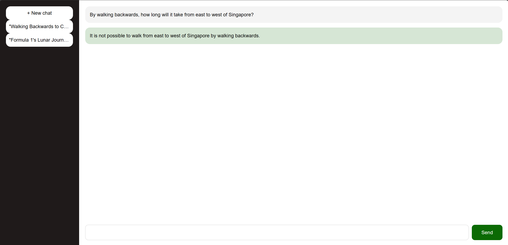

# GoogleChatHTMX

This project is the direct inpiration of unconv/ChatHTMX

These packages are essential for this project:
1. HTMX
2. ChatGoogleGenerativeAI
3. FastAPI
4. Jinja2

The aim is to create simple ChatGPT clone with FastAPI backend without Javascript

The main difference with hthis project than Unconventional Coding's is this use Gemini's free API

# How to use:
1. Install packages in requirements.txt
2. Create .env file and include your Gemini Api token as GOOGLE_API_KEY
3. Just run `python GoogleGPT.py`

# Images:
